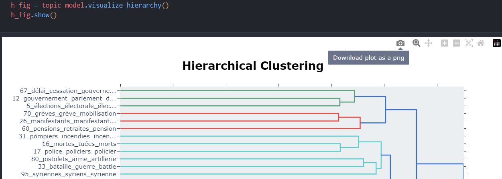

# Radicalism_Verbalized_NLP

# Setup Instructions

Firstly, it's recommended to set up a new environment to run this project. Before running the tasks for the first time, please do the following:

### 1. **Environment Setup:**

*Note, requires python 3.10 or greater*

**If using python venv, run:**

```
python -m venv `<your_venv_name>`
```

*Bash/Zsh Activation*
*(Mac/Linux)*

```
#bash/zsh
source <your_venv_name>/bin/activate 
```

*Windows Activation*

```
<your_venv_name>\Scripts\activate.bat
```

**If using conda, run:**

```
conda create --name your_env_name python=3.10
conda activate your_env_name
```

#### 2. Clone the Repository

```
git clone https://github.com/Nivedithabp/Radicalism_Verbalized_NLP.git
```

#### 3. Install Dependencies

- *NOTE*: python version **3.10** or greater is required.

```
pip install -r requirements.txt

```

---

#### 4. Running Task 1: *Keyword/Key Phrase Extraction*

- The first thing you'll want to ensure is that you have made the text you want processed accesibile by the keyword extraction. There are two ways to do this:
  - 1. When prompted by the notebook, if you want manually enter your text, you can type ``text`` in the prompt window. You will then be prompted a second time to enter you text manually.
  - 2. If you want to read in a text file, type in ``file``, which will have it be read from the related folder it's been uploaded from.

    - A note on option #2: We will want to have an open dialouge about what will be easiest for the team regarding making their files readable. We can have a back-and-forth dialouge about this and adjust.
- Once the data is read, the keyword/key-phrase extractors should be able to do the rest. After it's decided which one yields the best results, we can work on writing that to a save file.

---

#### 5. Running Task 2: *Topic Modeling*

- Firstly, before running the notebook to extract Topics from the text, sign up for Neo4j.
  - Only required if using a Neo4j Knowledge Graph is desired.
- Run the Jupyter notebook, **topic_modeling.ipynb**, after having entered the desired data to run Topic and extraction on.
  - Similar to the `file` option above in Task 1, this will look very similar. We will want to adjust this for what works best.
- The notebook should on it's own generate 3 different visualizations, as well as document info in a .csv format.
  - For saving the document info, we can work through how to best write these results out to a file.
  - For the visualizations, we are able to save these by clicking on the `Download plot as png` button in the top right of the image. *Screenshot shown below*
  - 

---

#### 6. Task 3: *Cognitive Bias Classification*

---
